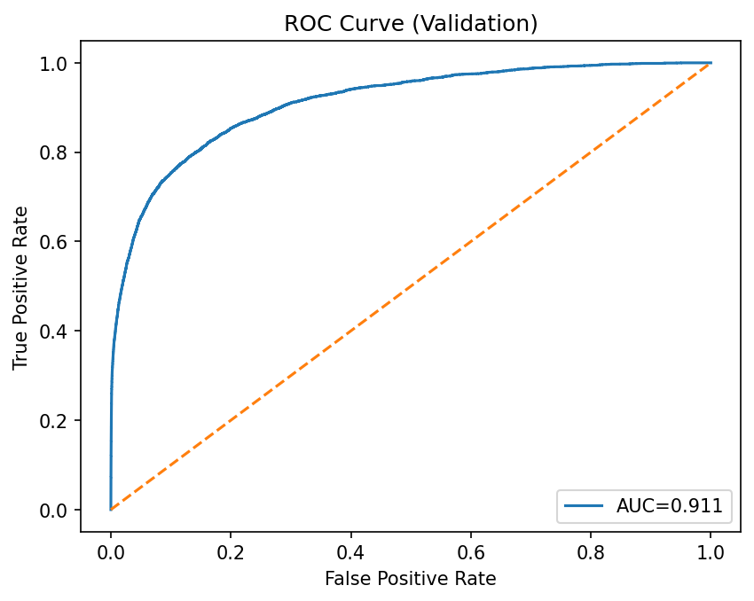
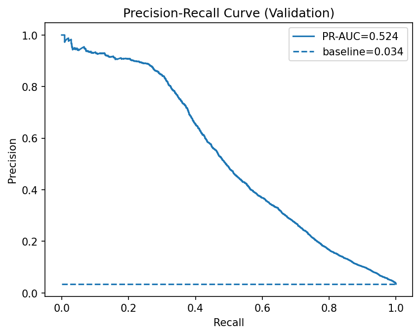
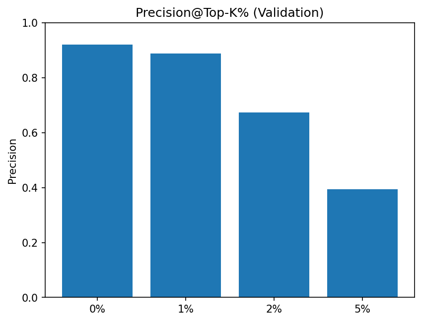
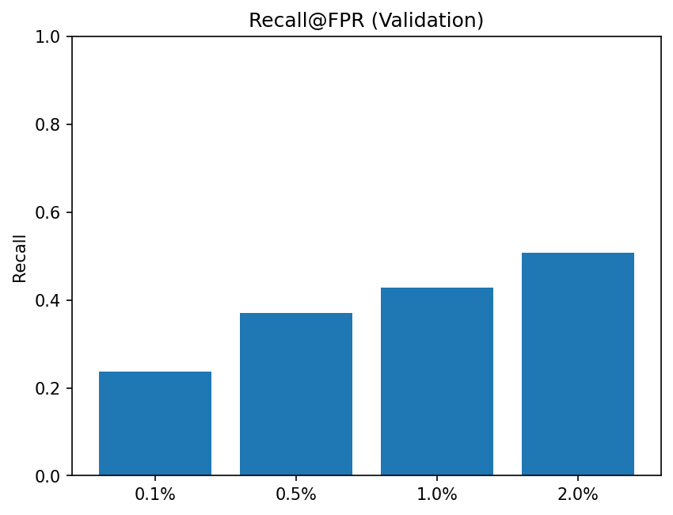

# Baseline Experiments

This folder tracks model baselines and their evaluation results.  
Each baseline is fully reproducible with pinned preprocessing, parameters, and splits.  

---

## Baseline v0 — LightGBM + Frozen Preprocessor

### 1. Data

- Source: `data/interim/train_clean_baseline.parquet` (md5: `<auto-filled>`)
- Split:  
  - `time_column`: `<dt/TransactionDT>`  
  - `t_cut`: `<YYYY-MM-DD HH:MM:SS>`  
- Validation set prevalence: **3.44%** (fraud share among validation rows)

This is a highly imbalanced dataset — only ~3.4% of transactions in validation are fraud. Any model evaluation must be done with metrics that account for imbalance.

---

### 2. Model

- Algorithm: **LightGBMClassifier**
- Parameters:  
  - `n_estimators = 5000` (large cap, early stopping governs stopping point)  
  - `early_stopping_rounds = 100`  
  - `learning_rate = 0.05`  
  - `num_leaves = 31`  
  - `min_data_in_leaf = 100`  
  - `feature_fraction = 0.9`  
  - `bagging_fraction = 0.8`  
  - `bagging_freq = 1`  
  - `scale_pos_weight = 27.46`  
  - `random_state = 42`

Parameters were chosen for stability and imbalance handling (`scale_pos_weight`). Early stopping ensures we don’t overfit despite a large cap on trees.

---

### 3. Validation Metrics

- **ROC-AUC:** 0.9115  
- **PR-AUC:** 0.5244  
  - No-skill baseline (positive prevalence): **0.0344**

#### Thresholded performance
- At **threshold = 0.5**  
  - Precision = 0.230  
  - Recall = 0.737  
  - F1 = 0.351  
- At **best-F1 threshold = 0.8113**  
  - Precision = 0.551  
  - Recall = 0.463  
  - F1 = 0.503  

- The model provides excellent ranking (ROC-AUC > 0.91) and strong lift over prevalence (PR-AUC = 0.52 vs 0.03 baseline).  
- At the default 0.5 threshold, the model catches most frauds (recall ~74%) but at the cost of many false positives (precision only ~23%).  
- Raising the threshold to ~0.81 balances things: precision ~55% with recall ~46%. This illustrates the **precision–recall tradeoff** and why threshold choice must align with business cost/benefit.

---

### 4. Curves

- ROC Curve: `data/interim/figures/roc_val.png`  
- Precision–Recall Curve: `data/interim/figures/pr_val.png`  
- Precision@K Curve: `data/interim/figures/precision_at_k_val.png`  
- Recall@FPR Curve: `data/interim/figures/recall_at_fpr_val.png`
### Curves

  
  

  
  

The curves confirm that the classifier meaningfully ranks fraud cases above legitimate ones. PR curve shows strong lift across thresholds; Precision@K is useful for operational scenarios (e.g., top 1% flagged transactions). Recall@FPR curve helps if there’s a target false-positive budget.

---

### 5. Time-Based Cross Validation

- Fold 0: ROC-AUC = 0.926, PR-AUC = 0.610, Best Iter = 442  
- Fold 1: ROC-AUC = 0.940, PR-AUC = 0.660, Best Iter = 1098  
- Fold 2: ROC-AUC = 0.925, PR-AUC = 0.554, Best Iter = 1220  

**Mean performance:**  
- ROC-AUC ≈ **0.930 ± 0.007**  
- PR-AUC ≈ **0.608 ± 0.043**  
- Details saved in: `data/interim/reports/cv_time_splits_v0.json`

👉 **Interpretation:**  
The baseline model generalizes well across different time splits. ROC is consistently high; PR fluctuates more due to prevalence shifts — expected in fraud detection.

---

### 6. Feature Importance (Top 15 by Gain)

- V258, C13, V294, C8, card1, card2, TransactionAmt, M4, C1, card6, C14, V70, addr1, D2, C11

👉 **Interpretation:**  
The model emphasizes card features, transaction amount, address, and time-derived/engineered V* and C* variables. These are plausible fraud signals — no obvious “nonsense” features dominating, which increases trust in the baseline.

---

### 7. Reproducibility

- Artifacts saved:  
  - `models/baseline_lgbm.pkl`  
  - `data/interim/reports/metrics_v0.json`  
  - `data/interim/reports/eval_summary_v0.json`
- Random state pinned (`42`)  
- Preprocessor frozen (no re-fit on val)  
- No data leakage confirmed  

---

