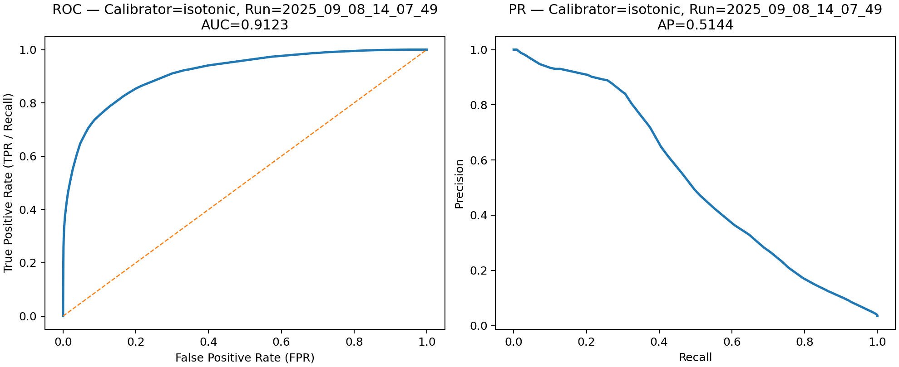

# Operating Points — Run `2025_09_08_14_07_49`

**Calibrator:** `isotonic`  
**Window:** `full` (unique days: `42`)

**Files:**  
- Operating points (CSV): `baseline_operating_points_isotonic_calibrated_2025_09_08_14_07_49.csv`  
- ROC/PR (calibrated): `roc_pr_calibrated_run_2025_09_08_14_07_49.png`

## Why this report
- Thresholds are in **probability space** (e.g., τ = 0.92 → 92% risk).
- Provides two operating modes: **Top-K%** (capacity) and **Recall@FPR** (risk budget).

## ROC & PR (calibrated)

## Top-K% (capacity view)
> Sorted by `p_cal ↓, time ↑, id ↑`; exactly Nₖ alerts; threshold = `p_cal` at Nₖ-th row.

| K% | threshold (p_cal) | precision | recall | FPR | alerts | alerts/day |
|---:|---:|---:|---:|---:|---:|---:|
| 0.5%% | 0.842742 | 0.9306 | 0.1353 | 0.000360 | 591 | 14.07 |
| 1.0%% | 0.680851 | 0.8883 | 0.2584 | 0.001157 | 1182 | 28.14 |
| 2.0%% | 0.305031 | 0.6780 | 0.3942 | 0.006673 | 2363 | 56.26 |
| 5.0%% | 0.153705 | 0.3957 | 0.5750 | 0.031295 | 5906 | 140.62 |

## Recall @ FPR (risk budget view)
> Conservative choice: largest τ with `FPR ≤ budget`; thresholds at unique probability boundaries.

| FPR % | threshold (p_cal) | precision | recall | FPR | alerts | alerts/day |
|---:|---:|---:|---:|---:|---:|---:|
| 0.1%% | 0.818182 | 0.9017 | 0.2143 | 0.000833 | 966 | 23.00 |
| 0.5%% | 0.396907 | 0.7256 | 0.3708 | 0.004998 | 2077 | 49.45 |
| 1.0%% | 0.277419 | 0.6120 | 0.4254 | 0.009610 | 2825 | 67.26 |
| 2.0%% | 0.203810 | 0.4916 | 0.4980 | 0.018353 | 4117 | 98.02 |

## How to pick a threshold
- **Capacity constrained** (we can review ~X/day): choose the **Top-K%** row with `alerts/day ≈ X`; set **τ** to that row’s `threshold (p_cal)`.
- **Risk budgeted** (allow ≤Y% false-positive rate): choose the **FPR** row with budget **Y**; set **τ** to that row’s `threshold (p_cal)`.

## Sanity notes
- Top-K: precision should be non-increasing as K grows; recall/FPR generally increase.
- Recall@FPR: recall is non-decreasing as budget increases; FPR is against negatives only (FP/(FP+TN)).
- Deterministic ties: ordering by `p_cal ↓, time ↑, id ↑` ensures stability; predictions use `p ≥ τ`.
